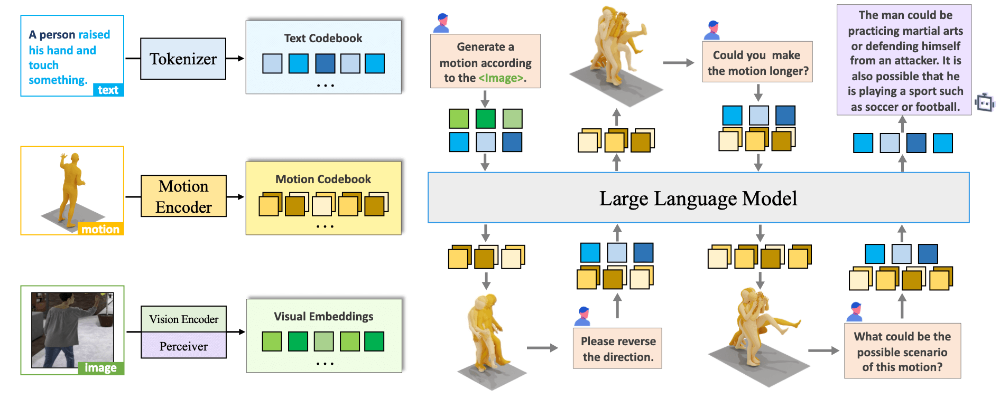

<div align= "center">
    <h1> Official repo for MotionChain</h1>

</div>

<div align="center">
    <h3> MotionChain: Conversational Motion Controllers via Multimodal Prompts</h3>

<p align="center">
  <a href="https://arxiv.org/pdf/2404.01700">Arxiv Paper</a> •
  Demo •
  <a href="#️-faq">FAQ</a> •
  <a href="#-citation">Citation</a>
</p>

</div>

<div align="center">
</div>

## Intro MotionChain

MotionChain is a unified
vision-motion-language generative pre-trained model, which performs **conversational**
generation tasks via **multi-modal** inputs with language models.

<details open="open">
    <summary><b>Technical details</b></summary>

The advent of large language models, enabling flexibility through instruction-driven approaches, has revolutionized many traditional generative tasks, but large models for 3D data, particularly in comprehensively handling 3D shapes with other modalities, are still under-explored. By achieving instruction-based shape generations, versatile multimodal generative shape models can significantly benefit various fields like 3D virtual construction and network-aided design. In this work, we present ShapeGPT, a shape-included multi-modal framework to leverage strong pre-trained language models to address multiple shape-relevant tasks. Specifically, ShapeGPT employs a word-sentence-paragraph framework to discretize continuous shapes into shape words, further assembles these words for shape sentences, as well as integrates shape with instructional text for multi-modal paragraphs. To learn this shape-language model, we use a three-stage training scheme, including shape representation, multimodal alignment, and instruction-based generation, to align shape-language codebooks and learn the intricate correlations among these modalities. Extensive experiments demonstrate that ShapeGPT achieves comparable performance across shape-relevant tasks, including text-to-shape, shape-to-text, shape completion, and shape editing.


</details>

## 🚩 News

- [2024/04/02] Upload paper and init project 🔥🔥🔥

## ⚡ Quick Start

<!-- <details>
  <summary><b>Setup and download</b></summary>

</details> -->

## ▶️ Demo

<!-- <details>
  <summary><b>Webui</b></summary>


</details> -->

## 👀 Visualization

## ⚠️ FAQ

<details> <summary><b>Question-and-Answer</b></summary>

</details>
</details>

## 📖 Citation

If you find our code or paper helps, please consider citing:

```bibtex
@misc{jiang2024motionchain,
      title={MotionChain: Conversational Motion Controllers via Multimodal Prompts},
      author={Biao Jiang and Xin Chen and Chi Zhang and Fukun Yin and Zhuoyuan Li and Gang YU and Jiayuan Fan},
      year={2024},
      eprint={2404.01700},
      archivePrefix={arXiv},
      primaryClass={cs.CV}
}
```

## Acknowledgments

Thanks to [BEDLAM](https://github.com/pixelite1201/BEDLAM), [TMR](https://github.com/Mathux/TMR), [vector-quantize-pytorch](https://github.com/lucidrains/vector-quantize-pytorch), [Motion-GPT](https://github.com/OpenMotionLab/MotionGPT), [Motion-latent-diffusion](https://github.com/ChenFengYe/motion-latent-diffusion), [T2m-gpt](https://github.com/Mael-zys/T2M-GPT), [TEMOS](https://github.com/Mathux/TEMOS), [ACTOR](https://github.com/Mathux/ACTOR), [HumanML3D](https://github.com/EricGuo5513/HumanML3D) and [joints2smpl](https://github.com/wangsen1312/joints2smpl), our code is partially borrowing from them.

## License

This code is distributed under an [MIT LICENSE](LICENSE).

Note that our code depends on other libraries, including SMPL, SMPL-X, PyTorch3D, and uses datasets which each have their own respective licenses that must also be followed.
